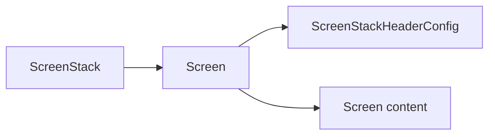

# MDX components cheatsheet

Live examples of every MDX component swizzled into this site. Use this page as a reference when writing or reviewing docs.

## Admonitions

Built-in Docusaurus admonitions, restyled via the `Admonition` swizzle. Open a `:::type` fence, write any markdown inside, close with `:::`.

:::note
A neutral side note. Use for things that don't fit the main flow but are worth saying.
:::

:::tip
Practical advice or a recommended path. Use sparingly so the signal stays high.
:::

:::info
Background context. Use when the reader benefits from extra explanation but doesn't strictly need it.
:::

:::caution
A footgun or non-obvious gotcha. Use when ignoring this will cost the reader time.
:::

:::danger
Reserved for irreversible or destructive actions. Use very rarely.
:::

### Source

```md
:::caution
A footgun or non-obvious gotcha.
:::
```

## Collapsible `<details>`

Native MDX `<details>` / `<summary>`, restyled via the `MDXComponents/Details` swizzle. Good for type definitions, optional context, or long tangents.

<details>
  <summary>Type definition for a hypothetical Screen component</summary>

  ```ts
  export interface ScreenProps {
    children?: React.ReactNode;
    stackPresentation?: 'push' | 'modal' | 'transparentModal';
    onWillAppear?: () => void;
    onAppear?: () => void;
    onWillDisappear?: () => void;
    onDisappear?: () => void;
  }
  ```
</details>

### Source

````md
<details>
  <summary>Type definition for a hypothetical Screen component</summary>

  ```ts
  export interface ScreenProps {
    children?: React.ReactNode;
    // …
  }
  ```
</details>
````

## Tabs

Use for parallel snippets — npm vs yarn, iOS vs Android setup, JS vs TS variants.

import Tabs from '@theme/Tabs';
import TabItem from '@theme/TabItem';

<Tabs groupId="package-manager">
  <TabItem value="npm" label="npm">

  ```bash
  npm install react-native-screens
  ```

  </TabItem>
  <TabItem value="yarn" label="yarn">

  ```bash
  yarn add react-native-screens
  ```

  </TabItem>
</Tabs>

### Source

````mdx
import Tabs from '@theme/Tabs';
import TabItem from '@theme/TabItem';

<Tabs groupId="package-manager">
  <TabItem value="npm" label="npm">
    ```bash
    npm install react-native-screens
    ```
  </TabItem>
  <TabItem value="yarn" label="yarn">
    ```bash
    yarn add react-native-screens
    ```
  </TabItem>
</Tabs>
````

Pages that share the same `groupId` remember the user's choice across pages.

## Code blocks

Triple-backtick code fences with a language tag.

```ts
import { Screen } from 'react-native-screens';

export function Wrapper({ children }: { children: React.ReactNode }) {
  return <Screen>{children}</Screen>;
}
```

### Diff highlighting

Use `diff` for before/after snippets — green/red highlighting is wired up.

```diff
- <View style={{ flex: 1 }}>
+ <Screen style={{ flex: 1 }}>
    {children}
- </View>
+ </Screen>
```

### Highlighted lines

Use `// highlight-next-line` or `// highlight-start` / `// highlight-end` comments.

```ts
import { enableScreens } from 'react-native-screens';

// highlight-next-line
enableScreens();
```

### Source

````md
```ts
import { enableScreens } from 'react-native-screens';

// highlight-next-line
enableScreens();
```
````

## Mermaid diagrams

Fenced code blocks tagged `mermaid` render as diagrams. Prefer Mermaid over PNG/SVG diagrams whenever possible — they stay editable and theme-aware.



### Source

````md

````

## Platform compatibility table

Use a plain markdown table for the **Platform compatibility** section on component pages.

| iOS | Android | Web | tvOS | visionOS | Windows |
| --- | --- | --- | --- | --- | --- |
| ✅ | ✅ | ⚠️ | ✅ | ❌ | ❌ |

Use ⚠️ when the component works but with caveats — explain those in **Remarks**.

### Source

```md
| iOS | Android | Web | tvOS | visionOS | Windows |
| --- | --- | --- | --- | --- | --- |
| ✅ | ✅ | ⚠️ | ✅ | ❌ | ❌ |
```

## Light/dark images

Use `<ThemedImage>` from `@theme/ThemedImage` when an asset needs different versions per color scheme.

```mdx
import ThemedImage from '@theme/ThemedImage';
import useBaseUrl from '@docusaurus/useBaseUrl';

<ThemedImage
  alt="Screen anatomy"
  sources={{
    light: useBaseUrl('/img/screen-anatomy-light.png'),
    dark: useBaseUrl('/img/screen-anatomy-dark.png'),
  }}
/>
```

For videos, follow the same `featureName_light.mov` / `featureName_dark.mov` naming convention from [CONTRIBUTING.md](https://github.com/software-mansion/react-native-screens-docs/blob/main/CONTRIBUTING.md#recording-conventions) and pair them with a small wrapper component when one is needed.
